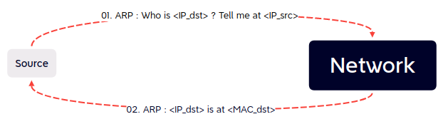

# Cme smb

```
cme smb 192.168.56.1/24
ARP request: Who has 192.168.56.0 ? Tell me <IP_source>
ARP answer : It's me <IP_dst>, you can find me on <MAC_dst>

1st attempt
TCP: [SYN,ACK] negociation

Request
SMB > NetBIOS > IPV4 : Negotiate Protocol Request
    Dialect: NT LM 0.12 

When the recipient doesn't support that th<at dialect
TCP: [RST,ACK]
```

<figure><figcaption></figcaption></figure>




```
2nd attempt
TCP: [SYN,ACK] negociation

Request
SMB > NetBIOS > IPV4 : Negotiate Protocol Request
    Dialects: NT LM 0.12 and SMB 2.xxx

When the recipient found an acceptable dialect, here it's SMB2
SMB2 > NetBIOS > IPv4 : Negotiate Protocol Response
    Signature enabled or not
    Signature required or not
    Dialect: SMB2 wildcard (0x02ff) what does it means ?

```

**0x2FFF SMB2 wildcard** revision number; indicates that the server implements SMB 2.1 or future dialect revisions and expects the client to send a subsequent SMB2 Negotiate request to negotiate the actual SMB 2 Protocol revision to be used. The wildcard revision number is sent only in response to a multi-protocol negotiate request with the "SMB 2.???" dialect string.



Here the SMB header of the client is SYNC and not ASYNC













And because of frame 17, we have this:






```

So 2nd negotiation
V2 is cool but what about V3 ?
SMB > NetBIOS > IPV4 : Negotiate Protocol Request
    Dialects: NT LM 0.12 and SMB 2.xxx

When the recipient found an acceptable dialect, here it's SMB2
SMB2 > NetBIOS > IPv4 : Negotiate Protocol Request with a Preauth Hash this time
    Dialects: 
        SMB 2.0.2
        SMB 2.1
        SMB 3.0
SMB2 > NetBIOS > IPv4 : Negotiate Protocol Response
TCP: ACK

```


<figure><figcaption></figcaption></figure>


